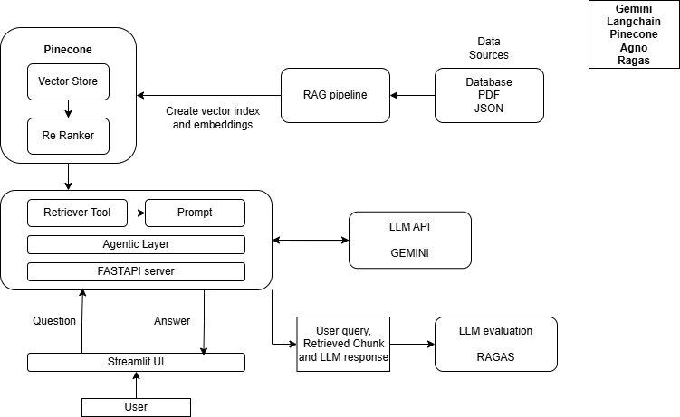

### Senor 2.0

<p align="center">
    <B>Architecture</B>
</p>

<p align="center">
    
</p>

📘 Gemini 2.0 Flash Model
Gemini 2.0 Flash is a lightweight, free-to-use multimodal model optimized for fast inference and low latency tasks.

It performs well on short-context LLM tasks like Q&A, summarization, and classification.

In Senor 2.0, it's used to generate final legal responses from re-ranked document chunks.

🧠 Pinecone Vector Store
Pinecone is a fully managed vector database that stores high-dimensional embeddings and performs fast approximate nearest-neighbor search.

It supports automatic scaling, filtering, metadata-based retrieval, and time-travel queries.

Pinecone indexes embeddings of chunked legal documents and supports fast retrieval at inference time.

📊 Reranking with bge-reranker-v2-m3
Retrieval is often noisy; reranking helps reorder initial results by computing a relevance score for each document-query pair.

Mathematically, it scores based on cosine similarity or a learned cross-encoder that assigns higher scores to more relevant matches.

Senor uses Pinecone's bge-reranker-v2-m3, which is fine-tuned for multilingual and domain-specific relevance tasks to improve legal document answer quality.

🧠 Agno AI Agents
Agno Agents enable tool-augmented LLM responses by allowing queries to be enhanced via external data sources like DuckDuckGo.

For Senor 2.0, Agno fetches real-time updates (laws, news, policies) and augments LLM responses when document context is insufficient.

📏 Evaluation with Ragas
Used for benchmarking LLM outputs through 3 quality dimensions:

Faithfulness: Measures if the LLM output sticks to facts present in the input context.

Response Relevancy: Assesses how directly the LLM output answers the user’s query.

LLMContextPrecisionWithoutReference: Evaluates how well the LLM uses the given context even without comparing to ground truth.

🛠️ Running the Project Locally
```bash
pip install -r requirements.txt
cd src
uvicorn main:app --reload
```