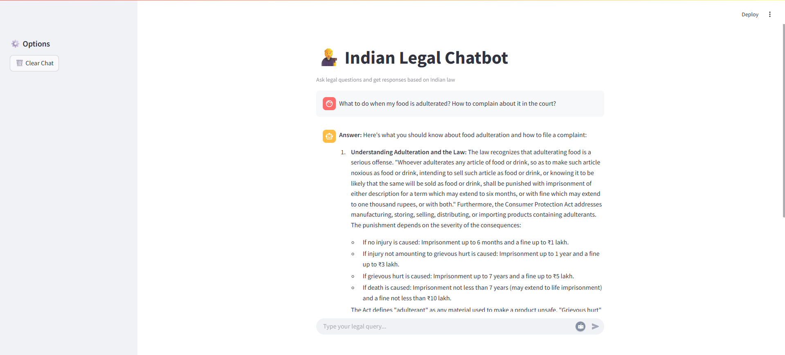
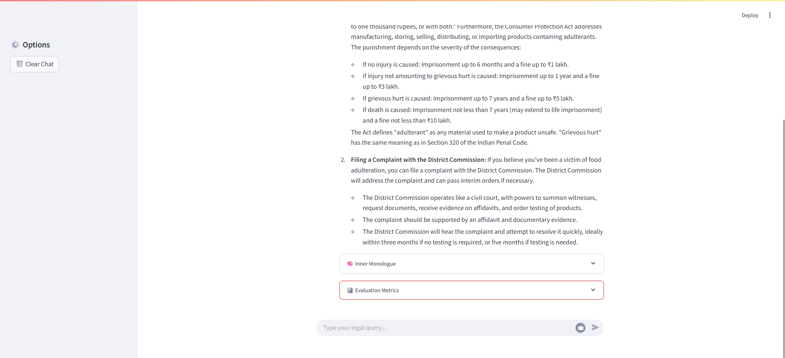

### Senor 2.0

<p align="center">
    <B>Screenshot</B>
</p>

<p align="center">
    
</p>
<p align="center">
    
</p>

---

### 🖥️ Senor 2.0 Frontend
A simple and responsive UI built using Streamlit to interact with the Senor 2.0 legal chatbot, enabling users to ask legal questions, receive LLM-generated responses, and evaluate them in a conversational format.

---

### ⚙️ Features
- 💬 Chat Interface for real-time legal Q&A

- 🔁 Session Memory to allow multi-turn conversations

- 🧹 Clear Chat button to reset the conversation

- 🔍 Auto Evaluation (Optional) to assess responses using Ragas metrics

- 🎯 Simple and clean UI with real-time response rendering

---

### 🚀 Tech Stack
**Streamlit** – Lightweight Python-based UI framework

**Requests** – For calling the FastAPI backend

**Session State** – For maintaining conversation history

---

### 🧾 How to Run Locally

```bash
cd frontend
streamlit run app.py
```

---

### 🔧 Notes
- Ensure the FastAPI backend is running (as described in the backend README) and accessible via the base URL set in your frontend code.
- You can update the backend API URL in app.py if hosted remotely.

---